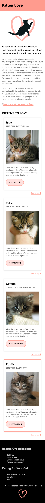
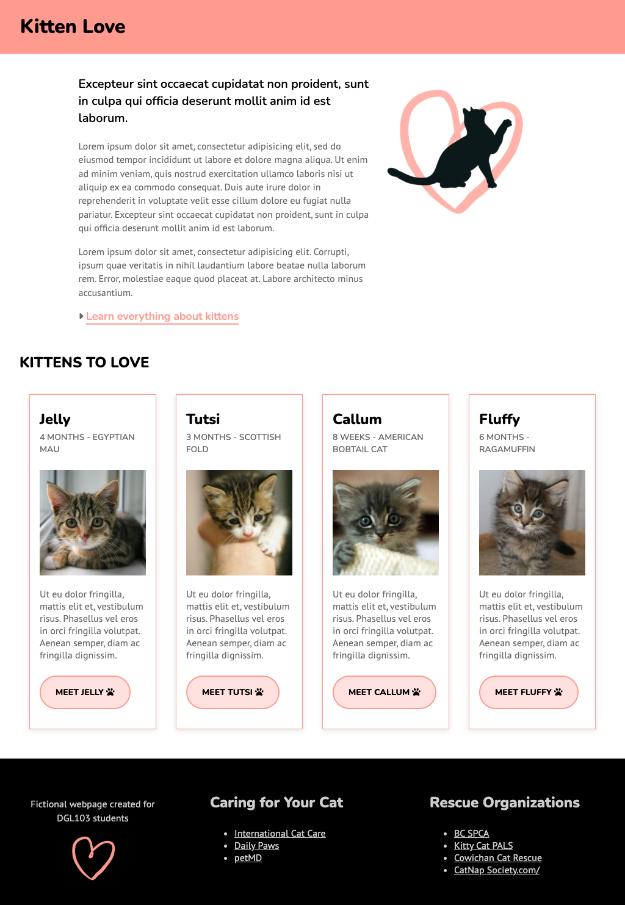

# Week 9 Exercise - Media Queries

## Objectives
You will use the provided HTML and CSS as a starting point, and add to it so that the layout looks like the provided examples and works on all screen sizes up to 1024px wide.

## Instructions
Remember to make regular commits with descriptive labels.
### 1. Get set up
* Clone your remote exercise repository onto your local machine.
* Add a comment in the head element of the homepage including: the course code and your section number - your name - Week 9 Exercise. Example:
```
<!-- DGL 103 CVS1 - your name - Week 9 Exercise -->
```
### 2. Design the page for a small screen
Start the process by viewing the web page at a small window size to simulate what it might look like on a mobile device: 
  1. With the webpage open in Chrome, right-click > Inspect. 
  2. In the DevTools window, click on the Toggle Device button (in top left-hand corner).
  3. In the browser window, select iPhone SE from the Dimensions drop down menu.
  4. Make all HTML and CSS changes necessary to make the page look like the example below:<br>

  

  |  |
|-|

By designing for the small screen first we're using what is known as a mobile-first approach. By doing this, we create a basic design that will fit small screens and low bandwidth, and then add advanced features or layouts as the screen grows. This ensures that we're designing an experience that will work for everyone. It also has the side effect of often helping us realize what content on our website is really important.

### 3. Introduce a new breakpoint for ipads
  1. In the browser window, select iPad Air from the Dimensions drop down menu.
  2. Add the following media query at the bottom of your CSS:
```
  /* Medium devices (ipads, 768px and up) */
@media only screen and (min-width: 768px) {

}
```
  3. Make all HTML and CSS changes necessary to make the page look like the example below:<br>
  

### 4. Create another breakpoint for large screens
  1. In the browser window, select Responsive from the Dimensions drop down menu. Type 1200 in the first text field to change the width of the viewport.
  Note: If the computer that you are working on has a small screen and you can't see the whole viewport window then you may need to work on a lab computer (for a professional website, I would add an extra breakpoint for extra large devices at 1366 pixels).
  2. Add the following media query at the bottom of your CSS:
```
/* Large devices (small laptops, 1024px and up) */
@media only screen and (min-width: 1024px) {

}
```
  3. Make all HTML and CSS changes necessary to make the page look like the example below:<br>
  

### 5. Check the layout in between the breakpoints
  1. In the browser window, select Responsive from the Dimensions drop down menu.
  2. Drag to expand your viewport width. Check that the layout works on all screen sizes, even between the breakpoints. Look for anything that needs to be fine-tuned, for example, the line length might become too long for the text to be easily readable. Or perhaps the page becomes wide enough that it no long makes sense for the images to display in a stack.
  3. If anything needs to be tweaked, record the viewport width at this point. Add a new media query using the width of the viewport as the min-width.
  4. Add any necessary CSS to make the layout work.


### 4. Format, organize and add comments 
* Use the Prettier VSCode extension to format HTML and CSS code.
* Add organizational CSS comments and order your style rules so that your CSS is easy to read.
* Add a few comments to explain your HTML and CSS code and highlight anything of interest.

### 5. Check for errors
Use the VSCode HTMLHint extension and validate your code to make sure that it is correct (https://validator.w3.org/#validate_by_upload for HTML, https://jigsaw.w3.org/css-validator/ for CSS).

### 6. Submit your work
1. Commit your changes.
2. Push your changes to GitHub. 
3. Submit in Brightspace to the "Unit 3 Exercises" assignment and follow the instructions. 
4. If you have been using a lab computer on campus, remember to restart the computer.

## Deadlines
Assignments must be submitted before the end of the week but they will only be graded at the end of every unit. Late assignments will not be accepted and will receive an F. You can complete and submit a contract that allows you to extend the deadline for an assignment but you must email it to your instructor a minimum of 48 hrs before the deadline. Deadline extensions are only allowed for those unplanned, unexpected emergencies that life sometimes throws at us, and they will only be approved by your instructor if you follow the correct process. See the Course Info folder in BrightSpace for more info.